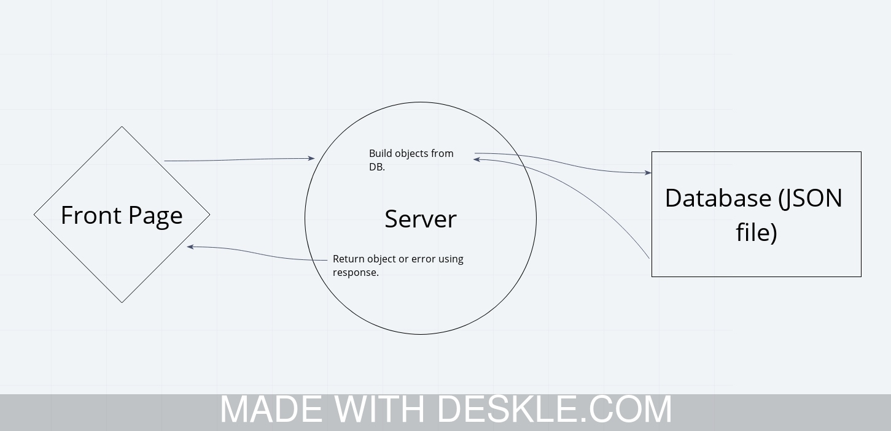
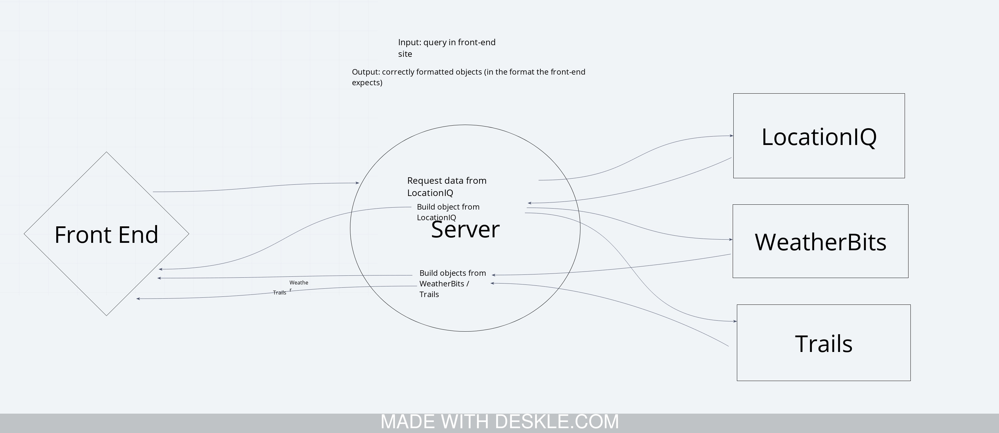

# CF - 301 - City Explorer API

**Author**: Paul M. Rest
**Version**: 1.0.0

## Overview
An API that returns location and weather data at the `/location` and `/weather` paths.

## Getting Started
1. Clone Git repository to your local machine
1. Install Node.js
1. Install the following npm (Node Package Manager) libraries:
* express
* dotenv
* cors
1. Deploy
1. Plug deployed URL into City Explorer front-end app

## Architecture
Built using Node.js, and the Node libraries:
*express
*dotenv
*cors

## Change Log
2020-06-08 5:45 PM PDT: API now capable of returning basic location and weather data from static JSON files. Also throws an error when
attempting to access an API path that doesn't exist.

## Credits and Collaborations

## Time Estimates and Actuals

### Lab-06

Number and name of feature: Feature 01 - Set Up Repo

Estimate of time needed to complete: 30 minutes

Start time: 2:15

Finish time: 3:00 PM PDT

Actual time needed to complete: 45 minutes

***

Number and name of feature: Feature 02 - Location Data

Estimate of time needed to complete: 1 hour

Start time: 3:00 PM PDT

Finish time: 4:00 PM PDT

Actual time needed to complete: 1 hour

***

Number and name of feature: Feature 03 - Weather Data

Estimate of time needed to complete: 30 minutes

Start time: 4:00 PM PDT

Finish time: 5:00 PM PDT

Actual time needed to complete: 1 hour

***

Number and name of feature: Feature 05 - Error Handling

Estimate of time needed to complete: 30 minutes

Start time: 5:00 PM PDT

Finish time: 5:35 PM PDT

Actual time needed to complete: 35 minutes

### Lab-07

Number and name of feature: Feature 01 - Data Formatting (Refactor to Use Array.Map)

Estimate of time needed to complete: 15 minutes

Start time: 2:30 PM PDT

Finish time: 3:20 PM PDT

Actual time needed to complete: 15 minutes - spent time reviewing code and helping others at my tale with theirs

***

Number and name of feature: Feature 02 - Get Location Data from LocationIQ API

Estimate of time needed to complete: 1 hour

Start time: 3:20 PM PDT

Finish time: 5:34 PM PDT

Actual time needed to complete: 1.5 hours? Ran into weird issues with Heroku and was also helping other students

***

Number and name of feature: Feature 03 - Weather from WeatherBit API

Estimate of time needed to complete: 1 hour

Start time: 5:37 PM PDT

Finish time: 9:02 PM PDT

Actual time needed to complete: about 1 hour. Spent a bunch of time helping others, then took a break to eat food and not program.

***

Number and name of feature: Feature 04 - Hiking and Campgrounds

Estimate of time needed to complete: 1 hour

Start time: 9:05 PM PDT

Finish time: 10:29 PM PDT

Actual time needed to complete: 1 hour 25 minutes - there was a mismatch between the date-time format the front-end is looking for and the data from the API, so I ended up writing two custom functions to reformat the data.